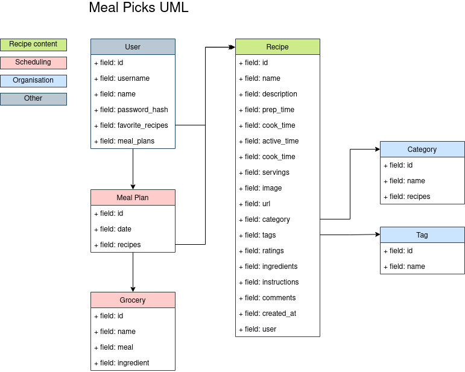

# Meal Picks Backend

[Meal Picks Backend](https://drab-tan-cow-wig.cyclic.app/) is an API server for recipe based projects. If you want to have an app or website with recipes, but don't want to spend a lot of time - this can be a good choice.

## Table of contents

- [Technical Design](https://github.com/joedravarol/meal-picks-backend#technical-design)
- [Getting Started](https://github.com/joedravarol/meal-picks-backend#getting-started)
- [Built With](https://github.com/joedravarol/meal-picks-backend#built-with)
- [Contributors](https://github.com/joedravarol/meal-picks-backend#contributors)
- [License](https://github.com/joedravarol/meal-picks-backend#license)
- [Acknowledgement](https://github.com/joedravarol/meal-picks-backend#acknowledgement)

## Technical Design

The application is a simple CRUD system around recipes and meals. In the domain model, a **recipe** is a set of instructions for preparing a particular dish, including the list of ingredients required. A **meal plan** is a dish planned at a specified date.

## Getting Started

These instructions will get you a copy of the project up and running on your local machine for development and testing purposes.

### Installing

1. Fork this repository on Github.
1. Clone your forked repository onto your local computer.
1. Use `$ cd meal-picks-backend` to move into the project directory.
1. Create a `.env` file in the root directory and add the following as `key = value` shown in `.env.example`
1. `$ npm run dev` to run a local development server.
1. Explore and enjoy!

## Built with

- Mongoose
- JsonWebToken
- Bcrypt
- Cloudinary
- Multer
- Continuous deployment with Cyclic
- Prettier
- ESlint
- [ReDoc](https://github.com/Redocly/redoc)

## Contributors

- **Joe Lee** - Initial work

## License

This project is licensed under the MIT license - see the [LICENSE](LICENSE) file for details

## Acknowledgement

- [Web Dev Simplified](https://www.youtube.com/c/WebDevSimplified) - [Paginated API](https://www.youtube.com/watch?v=ZX3qt0UWifc)
- [Full Stack open](https://fullstackopen.com/en/) - [Application structure](https://fullstackopen.com/en/part4/structure_of_backend_application_introduction_to_testing)
